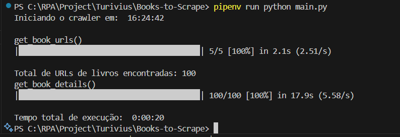

# Books-to-Scrape

Código sendo repassado e avaliado casos de type hint e a utilização do PEP8

Para esse desafio proponho como um bonus de entrega, proponho realizar Test Unitário (taxa 80%)


## Otimização do Código
### Section 1 - Implementação / Primeiro teste de perfomance:
- Na priomeira execução o RPA estava gastando aproximadamente (1:40 ~ 2:00) minutos:


Preciso reduzir esse tempo, pelo menos em 50%.

---

### Section 2 - Seggundo Teste:
- Segundo teste modifiquei algumas configurações do print no console. Nessa imagem abaixo é a configuração utilzando:

* Antes Antes 
```
    def get_html_content(html):
        return BeautifulSoup(html.text, 'lxml') 
```

* Depois
```
    def get_html_content(html):
        return BeautifulSoup(html.text, 'html') 
```

Adotado pois na [documentação requests](https://beautiful-soup-4.readthedocs.io/en/latest/) informa que xmlx é muito rápida. Mas o resultado obtido não teve grandes impactos.

* Resultado


---

### Section 3 - Terceiro Teste:

Foi feita algumas pesquisas sobre o loop de request em IAs e pela internet, descobri que utilizando o codigo abaixo consigo reutilizar a mesma sessão http para requisitar e obter respostas, sem precisar dar get a cada nova URL de livro.
Com isso reduzir:
 - Redução de tempo de mais de 87%;

 